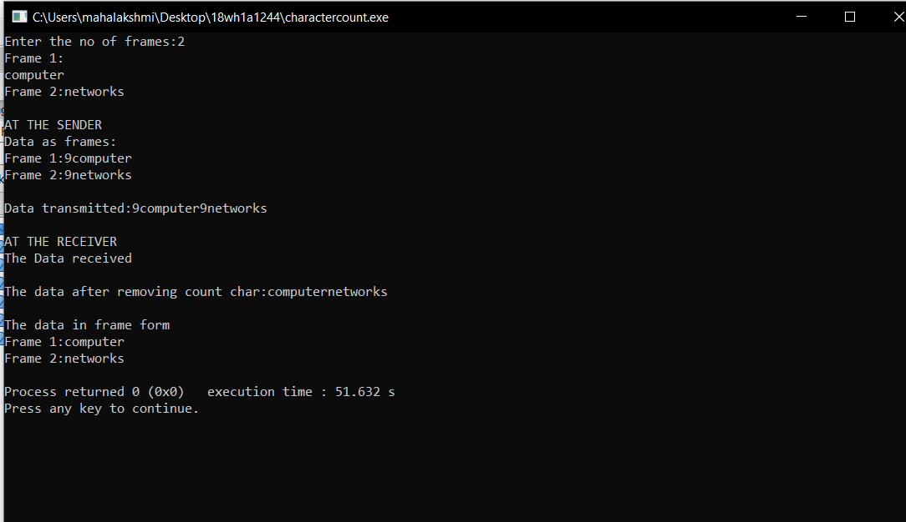
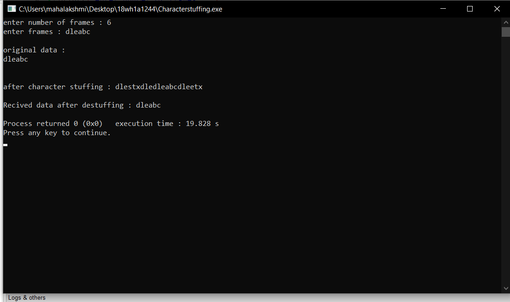
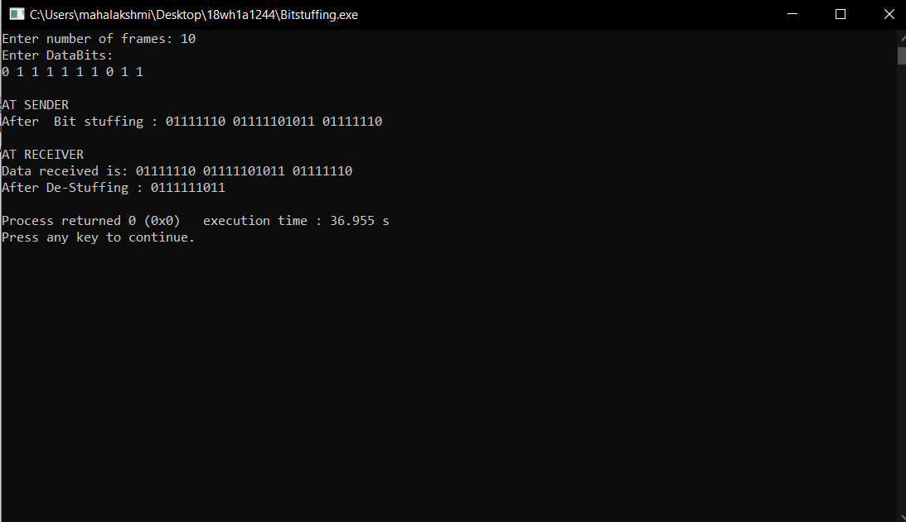

#Experiment1

##Aim of Experiment

To implement data link layer framing techniques such as :

i.character count

ii.character stuffing and

iii.bit stuffing

###step by step procedure of experime
#### For character count
1.Enter number of frames 2.print the data as frames 3.Find the string length of each frame 4.print the data both at sender side and receiever side.

#### For Character stuffing
1.Take the input characters size based on the input size enter character data 2.print the original data 3.Apply the character stuffing logic at the sender side and print the data 4.At the receiver side de-stuff the stuffed data and print the output.

#### For Bit stuffing
1.Take the input as number of frames 2.Enter Databits 3.Apply the bitstuffing logic at the sender side 4.De-stuff the bits at the receiver side and print the output.

### Outputs

### Character Count

####Character Stuffing

####Bit Stuffing

